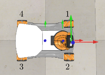
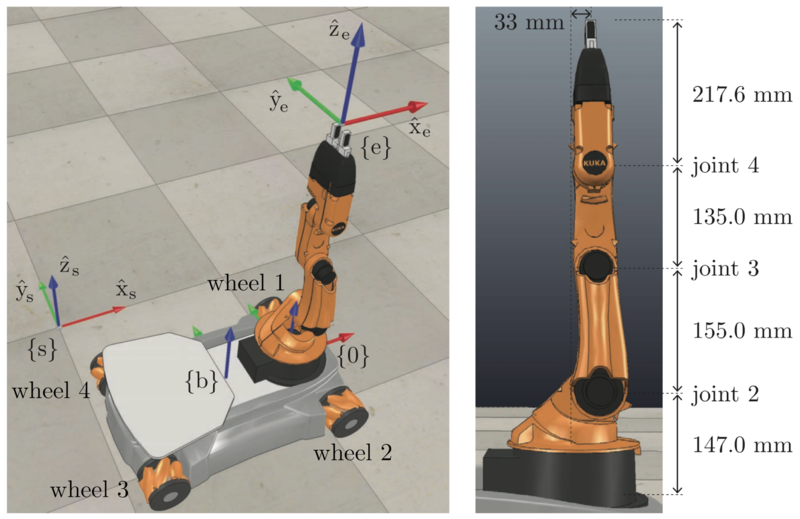
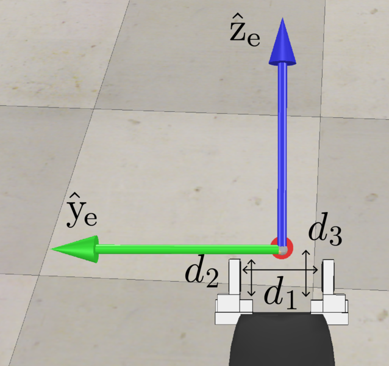

# 说明

---

在使用此源代码的时候，建议读者配合对应的文章教程进行阅读。文章链接详见知乎专栏“AI与机器人”或者微信公众号“博士的沙漏”中的第八期自学笔记。

本项目参考了美国西北大学的Kevin M. Lynch教授和韩国首尔国立大学的Frank C. Park教授共同编撰的《Modern Robotics: Mechanics, Planning and Control》一书，强烈建议有兴趣的读者阅读此书。

TrajectoryGenerator生成的reference trajectory一共有13个变量，分别表示

| 编号 |  1   |  2   |  3   |  4   |  5   |  6   |  7   |  8   |  9   |  10  |  11  |  12  |      13       |
| :--: | :--: | :--: | :--: | :--: | :--: | :--: | :--: | :--: | :--: | :--: | :--: | :--: | :-----------: |
| 数值 | phi  |  x   |  y   |  J1  |  J2  |  J3  |  J4  |  J5  |  w1  |  w2  |  w3  |  w4  | gripper state |

其中，

- x、 y、phi 分别表示World_X_Joint、World_Y_Joint、World_Th_Joint的坐标和偏转角度；
- J1， $\dots$， J5 分别表示youBot的机械臂上的5个关节角度；
- w1，$\dots$， w4分别表示front left, front right, rail right, rail left四个轮子的位置（旋转角度），如下图所示；
- gripper state即表示gripper的状态，0表示打开，1表示闭合。

注意：x、y 的单位是米，phi、J1~J5， w1~w4等角度的单位是弧度。控制Gripper的打开和闭合过程至少需要0.625秒，所以为了保证Gripper能正常完成Open/Close的动作，在编写程序控制Gripper从打开到闭合（或从闭合到打开），确保要在该位置保持0.625秒以上。

youBot地盘上四个轮子的编号如图所示：

分别对应w1、w2、w3、w4四个轮子旋转的角度。

在VREP中，youBot模型机械臂的基本尺寸参数如图所示：

对于抓手（Gripper）来说，其尺寸参数如图所示：

其中：
$$
d_{1, min} = 2 \ cm\\
d_{1, max} = 7 \ cm\\
d_2 = 3.5 \ cm\\
d_3 = 4.3 \ cm
$$
对于底盘来说，前后轮之间的距离是0.47m，左右轮之间的距离是0.3m，轮子的半径为0.0475m。
